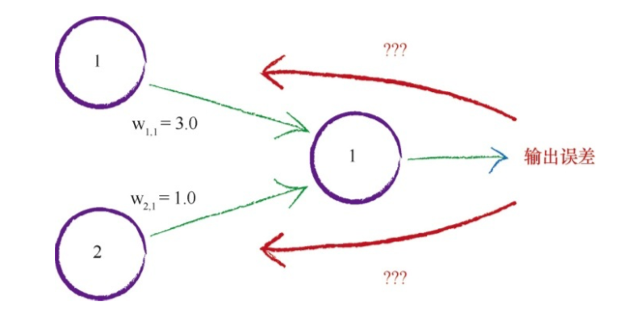
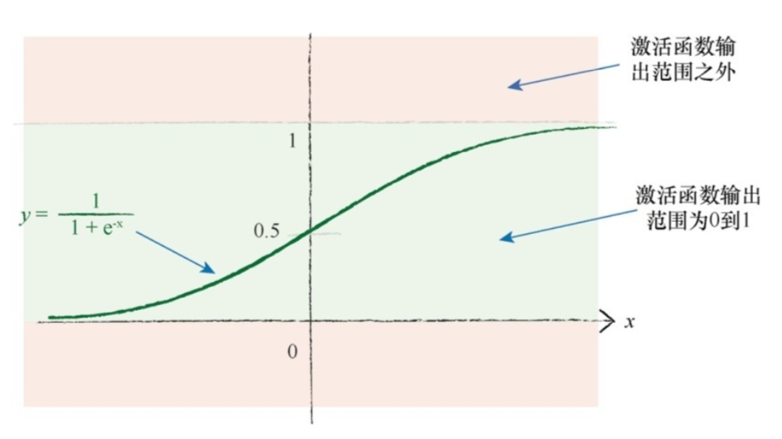

[TOC]

### 第一章 神经网络如何工作

"从你身边所有的小事情中，找到灵感。"

#### 尺有所短，寸有所长

+ 人工智能解决的难题

  希望计算机能更好地进行求解图像识别这类问题

#### 一台简单的预测机

+ 问题—> 思考--> 答案

+ 输入-->流程(计算) —>输出

+ 误差值 = 真实值-计算值

  用误差值指导我们得到第二个、更好的C的猜测值

  **建议** 将修正值取为误差值的百分比

+ 改进一个模型最好的一种方法是，基于模型和已知真实示例之间的比较，得到模型偏差的误差值，调整参数。

#### 分类器与预测期并无太大差别

+ 预测器：有一个简单的输入，并做有相应的预测，输出结果。

  根据结果与已知真实示例进行比较得到误差，调整内部参数，使预测更加精确

+ 分类器

#### 训练简单的分类器

也就是调整分界线的斜率

+ 训练数据

  用来训练预测器或分类器的真实实例

+ 算法

  用一系列的计算机指令让分类更准确，而非由人观察直觉去调整。

+ 找到需调整的参数和误差值之间的关系

+ 学习率  $L$

  调节系数，$\Delta(A) = L(E/x)$ 

  + 令 $L = 0.5$ 作为一个合理的系数开始学习过程，也就是只更新值的一半

#### 有时候一个分类器不足以求解问题

使用多个分类器一起工作

+ 如果数据本身不是单一线性过程支配，那么一个简单的线性分类器不能对数据进行划分。
+ 但是解决方案很容易，只需要使用多个分类器来划分由单一直线无法分离的数据

#### 神经元-----大自然的计算机器

+ 输入达到阈值输出才会触发

  

+ sigmoid

  S函数，有时也称为逻辑函数：**$y = \frac{1}{1 + e^{-x}}$ **

  ​			

  ​		

  

+ 神经元

  

  - 
  - 
    - 仿照人类神经元构建的多层神经网络

+ 加权重的神经元

  - 
  - 权重可以放大或缩小上一层神经元所传递信息对下一层的影响
  - 这种一致的完全连接形式事实上可以相对容易地编码成计算机指令
  - 神经网络的学习过程将会弱化这些实际上不需要的连接

#### 在神经网络中追踪信号

+ 计算机信号如何经过一层一层的神经元，从输入变成输出

  + 

  + 定义一些参数值

    

    + 第一层输入层，仅表示输入信号，输入结点不对输入值应用激活函数
    + 第二层用了激活函数$sigmoid$ 
    + 计算后的结果

    

    

#### 凭心而论，矩阵乘法大有用途

+ 通过神经网络向前馈送信号所需的大量运算可以表示为矩阵乘法
+ 不管神经网络的规模如何，将输入输出表达为矩阵乘法，使得我们可以更简洁地进行书写
+ 更重要的是，一些计算机编程语言理解矩阵计算，并认识到潜在的计算方法的相似性。这允许计算机高速高效地进行这些计算

#### 使用矩阵乘法的三层神经网络示例

+ 三层神经网络

  

  + 输入矩阵

    $I = [0.9, 0.1, 0.8]$  

  + 中间的隐藏层，中间层的每个节点都与输入层的每个节点相连，因此每个节点都得到输入信号的部分信息。 

  + 输入到中间层的组合调节信号为$X = W*I$  

  + 

  + 

  + 应用激活函数

    $O_{hidden} = sigmoid(X_{hidden})$ 

    在$X_{hidden} $ 层中的元素上应用$S$ 函数，生成中间隐藏层输出矩阵

    

    $S $ 函数的值域在0 和  1 之间，所有的值都处在这个区间。

  + 

  + $X_{output} = W_{hidden\_output} * O_{hidden}$

    

    

  + 对最后一层应用$S$ 激活函数 

    

    

#### 学习来自多个节点的权重

+ 当输出和误差是多个节点共同作用的结果时， 如何更新链接权重呢？

  

  使用所有的误差值，只对一个权重进行更新，这种做法忽略了其他链接及权重，毫无意义，多条链接都对这个误差值有影响。

  + 等分误差
  + 不等分误差，给权重值较大的链接分配更多的误差，按照贡献，分配误差。

#### 多个输出节点反向传播误差

+ 根据输出误差，修改权重

  

  + 使用两个误差来告知如何调整内部链接权重。可以跨越造成误差的多条连接，按照权重比例，分割输出节点的误差。

  + 输出节点的链接之间并不相互依赖，因而问题就变得简单了。

  + 第一个输出节点的误差值 $e_1 = (t_1 - o_1)$ 

  + 按比例分割误差值$e_1$ 
    + $\frac{w_{1,1}}{w_{1, 1} + w_{2, 1}}$      $\frac{w_{2, 1}}{w_{1, 1} + w_{2, 1}}$  

#### 反向传播误差到更多层中

+ 只有三层的神经网络

  

  + 可是对于隐藏层我们怎么计算误差呢？

    我们需要隐藏层节点的误差，这样我们就可以使用这个误差更新前一层中的权重。我们称为$e_{hidden}$  ,再次将这些误差按照输入层和隐藏层之间的链接权重$w_{ih}$  进行分割。
    
  + 

  + 向前馈送输入新松，隐藏层的每个节点确实有一个单一的输出，我们在该节点经过加权求和的信号上应用激活函数，才得到了这个输出，因此， 怎么才能计算出误差呢？

    对于隐藏层的节点，我们没有目标值或所希望的输出值。我们只有最终输出层节点的目标值，这个目标值来自于训练样本数据。

    

    我们需要隐藏层节点的误差，这样我们就可以使用这个误差更新前一层中的权重，我们称这个误差为$e_{hidden}$  

    

  + 误差向后传播

    

    继续和这一层一样向后传播

+ 关键点
  + 神经网络通过调整链接权重进行学习。这种方法由误差引导， 误差就是训练数据所给出正确答案和实际输出之间的差值
  + 简单地说，在输出节点处的误差等于所需值与实际值之间的差值
  + 然而，与内部节点相关联的误差并不显而易见。 一种方法是按照链路权重的比例来分割输出层的误差，然后在每个内部节点处充组这些误差。

#### 使用矩阵乘法进行反向传播误差

+ 矢量化计算方向传播

  

  为隐藏层的误差构建矩阵。

  

  + 后向传播误差

    

+ 关键点

  + 反向传播误差可以表示为矩阵乘法
  + 无论网络规模大小， 这使我们能够简洁地表达反向传播误差，同时也允许理解矩阵计算的计算机语言更高效、更快速地完成工作。
  + 这意味着前向馈送信号和反向传播误差都可以使用矩阵计算而变得高效。

#### 我们实际上如何更新权重

使用误差来指导如何调整链接权重，从而改进神经网络输出的总体答案。

数学太复杂，因此我们不能使用微妙的代数直接计算出的权重。

+ 可以使用更小的步子朝着实际的最小值方向迈进，优化答案，直到我们对于所得到的精度感到满意为止。

+ 

  + 梯度下降法是求解函数最小值的一种很好的办法， 当函数非常复杂困难，并且不能轻易使用数学代数求解函数时， 这种方法却发挥了很好的作用。
  + 更重要的是， 当函数有很多参数，一些其他方法不切实际，或者会得出错误答案，这种方法依然可以适用
  + 这种方法也具有弹性，可以容忍不完善的数据，如果我们不能完美地描述函数，或我们偶尔意外地走错了一步，也不会错的离谱

+ 神经网络本身的输出函数不是一个误差函数，但我们知道，由于误差是目标训练值与实际输出值之间的差值，因此我们可以很容易地把输出函数变成误差函数。

+ 误差函数

  + 使用误差的平方，我们可以很容易使用代数计算出梯度下降的斜率。
  + 误差函数平滑连续，这使得梯度下降法很好地发挥作用———没有间断，也没有突然的跳跃
  + 越接近最小值，梯度越小，这意味着，如果我们使用这个函数调节步长，超调的风险就会变得较小。

+ 要使用梯度下降的方法， 现在我们需要计算出误差函数相对于权重的斜率，

  最小化神经网络的误差函数。试图优化的参数是网络链接权重。

  当函数有多个参数的时候，要画出误差曲面相对较难， 但是使用梯度下降寻找最小值的思想是相同的。

+ $\frac{ \alpha{E}}{ \alpha{W_{j,k}}}$

  这个表达式表示了当权重$w_{j,k}$ 改变时，误差$E$ 是如何改变的。这是误差函数的斜率，也就是我们希望使用梯度下降的方法到达最小值的方向

+  

  展开误差函数: $\frac{\alpha{E}}{\alpha{w_{j,k}}} = \frac{\alpha}{\alpha{w_{j,k}}} \sum_n(t_n - o_n)^2$  

  在节点n的输出$o_n$ 只取决于连接到这个节点的链接，因此我们可以直接简化这个表达式，意味着， 由于这些权重是链接到节点$k$ 的权重，因此节点$k$ 的输出$o_k$ 只取决于权重$w_{j,k}$ 

  $\frac{\alpha{E}}{\alpha{w_{j,k}}} = \frac{\alpha}{\alpha{w_{j,k}}} (t_k - o_k)^2$ 

  $t_k$ 是一个常数， 不会随着$w_{j,k}$ 的变化而变化。也就是说，$t_k$ 不是$w_{j,k}$ 的函数。

  +  **链式法则 **     $ \frac{\alpha{E}}{\alpha{w_{j,k}}} = \frac{\alpha{E}}{\alpha{o_k}} \times \frac{\alpha{o_k}}{\alpha{w_{j,k}}}$

    展开 ：$ \frac{\alpha{E}}{\alpha{w_{j,k}}} = -2(t_k - o_k)\times \frac{\alpha{o_k}}{\alpha{w_{j,k}}}$

    $ \frac{\alpha{E}}{\alpha{w_{j,k}}} = -2(t_k - o_k)\times \frac{\alpha}{\alpha{w_{j,k}}} sigmoid(\sum_jw_{j,k} \times o_j)$ 

    其中  $\frac{\alpha{}}{\alpha{x}} sigmoid(x) = sigmoid(x)(1-sigmoid(x))$

    $ \frac{\alpha{E}}{\alpha{w_{j,k}}} = -2(t_k - o_k)\times \frac{\alpha}{\alpha{w_{j,k}}} sigmoid(\sum_jw_{j,k} \times o_j)$

    ​          $= -2(t_k-o_k) \times sigmoid(\sum_jw_{j,k} \times o_j) (1- sigmoid(\sum_jw_{j,k} \times o_j)) \times(\frac{\alpha{}}{\alpha{w_{j,k}}}{\sum_j w_{j,k} \times o_j})$  $= -2(t_k-o_k) \times sigmoid(\sum_jw_{j,k} \times o_j) (1- sigmoid(\sum_jw_{j,k} \times o_j)) \times o_j$ 

    + 第一部分的(目标值-实际值)误差，现在变成了隐藏层节点中重组的向后传播误差，正如在前面所看到的那样，称之为$e_j$
    +  sigmoid部分可以保持不变，但是内部的求和表达式指的是前一层，因此求和的范围是所有由权重调节的进入的隐藏层节点$j$ 的输入。
    + $new \ w_{j,k} =  old \ w_{j,k} - \alpha\cdot\frac{\partial E}{\partial w_{j,k}}$

  + **矩阵形式**

    $\Delta w_{j,k} = \alpha \cdot E_k \cdot O_k(1-O_k) \cdot O_j^T$

+ 关键点

  + 神经网络的误差是内部链接权重的函数
  + 改进神经网络，意味着通过改变权重减少这种误差
  + 直接选择合适的权重太难了，另一种方法是，通过误差函数的梯度下降，采取小步长，迭代地改进权重，所迈出的每一步的方向都是在当前位置向下斜率最大的方向，这就是所谓的梯度下降
  + 使用微积分可以很容易地计算出误差斜率

#### 权重更新成功实例

#### 准备数据

准备训练数据，初始随机权重，设计输出值。

+ 输入

  如果输入变大， 激活函数就会变得非常平坦

  使用梯度学习新的权重，因此一个平坦的激活函数会出问题。

  权重的改变取决于激活函数的梯度，小梯度意味着限制神经网络的学习能力。这就是所谓的饱和神经网络。这意味着，我们应该尽量保持小的输入。

  好的解决办法就是，可以重新调整输入值， 将其范围控制在0.0到1.0，输入0 会将$o_j$ 设置为0，这样权重更新表达式就会等于0，从而造成学习能力的丧失，因此在某些情况下，我们会将此输入加上一个小小的偏移，如0.01避免输入0 带来麻烦。

+ 输出

  

  逻辑函数的输出值不可能大于1 小于0

+ 随机初始权重

  大的权重会造成大的信号传递给激活函数，导致网络饱和，从而降低网络学习到更好的权重能力，因此应该避免大的初始权重值。

  + 一些过大的初始权重将会在偏置方向上偏置激活函数，非常大的权重将会使激活函数饱和。

+ 关键点

  + 如果输入、输出和初始权重数据的准备与网络设计和实际求解的问题不匹配，那么神经网络并不能很好地工作
  + 一个常见的问题是饱和，在这个时候，大信号导致了应用在信号上的激活函数的斜率变得非常平缓，这降低了神经网络学习到更好权重的能力
  + 另一个问题是零值信号或零值权重，这也可以使网络丧失学习更好权重的能力
  + 内部连接的权重应该是随机的，值较小，但要避免零值，如果节点的传入连接较多，有一些人会使用相对复杂的规则，如减小这些权重的大小。
  + 输入应该调整到较小值，但不能为零，一个常见的范围为0.01-0.99 或-1.0-1.0使用哪个范围，取决于是否匹配了问题
  + 输出应该在激活函数能够生成的值得范围内，逻辑S函数是不可能生成小于等于0或大于等于1 的值，将训练目标值设置在有效的范围之外，将会驱使产生越来越大的权重，导致网络饱和。

### 第二章  使用python进行DIY

#### python

#### 交互式python = Ipython

#### 优雅地开始使用Python

+ Jupyter notebook
+ 简单的python
+ 自动化工作
+ 注释
+ 函数
+ 数组
+ 绘制数组
+ 对象

#### 使用python制作神经网络

+ 框架代码

  + 初始化函数-----设定输入层节点，隐藏层节点和输出层节点的数量
  + 训练——学习给定训练集样本后，优化权重
  + 查询——给定输入，从输出节点给出答案

+ 初始化网络

  + 设置输入层节点、隐藏层节点和输出层节点的数量。这些节点的数量定义了神经网络的形状和尺寸。

    当使用参数创建一个新的神经网络对象时， 才会确定这些数量。

+ 权重----网络的核心

  创建网络的节点和链接。网络中最重要的部分是链接权重，我们使用这些权重来计算前馈信号、反向传播误差，并且在试图改进网络时优化链接权重本身。

  - 在输入层和隐藏层之间的链接权重矩阵 ,大小为
- 隐藏层和输出层之间的链接权重矩阵，大小为
  
+ 可选项：较复杂的权重

  正态概率分布采样权重，其中平均值为0，标准方差为节点传入链接数目的开方。

#### 查询网络

+ query()函数接受神经网络的输入，返回网络的输出。

  输入层和隐藏层之间的链接权重矩阵如何与输入矩阵相乘，给出隐藏层节点的输入信号

  $X_{hidden} = W_{input\_{hidden}}\cdot I$

  查询代码

+ 

+ 

  

  

  

  

  

  

  

  

  

  

  

  

  

  

  

  

  

  

  

  

  

  

  

  

  

  

  

  

  