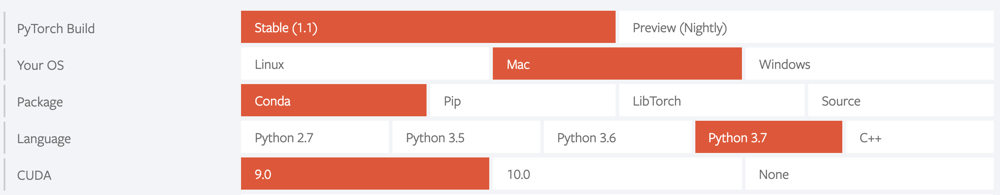

## Pytorch入门

+ install pytorch

  ```
  conda install pytorch torchvision -c pytorch
  ```

  

  
  
+ pytorch Tutorials

  ###  Deep learning with pytorch: a 60 minute blitz

  + **goal:**train a small neural network to classify images

  + **What is pytorch?**

    + **Tensors**

      