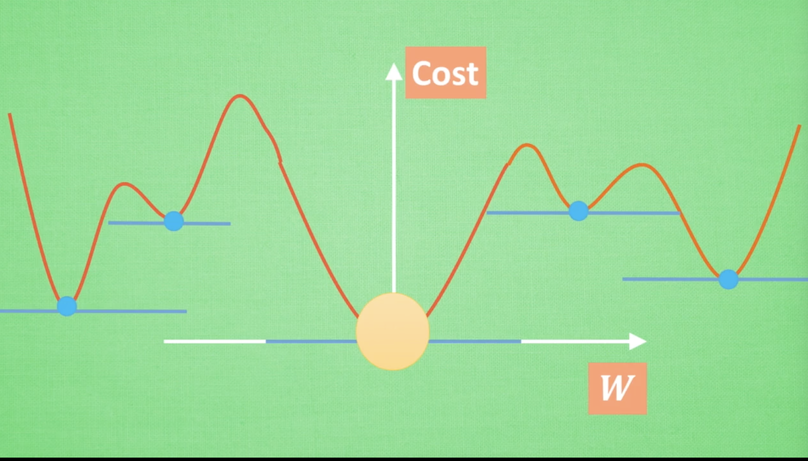

# Pytorch动态神经网络

### 前言

+ 人工神经网络 VS 生物神经网络

  并不相等

  就像飞机模仿鸟而不等于鸟

+ 什么是神经网络

  数学模型或计算机模型

  + 基于传统统计学建模的工具

  + 神经网络系统由多层神经元构成，由输出层输出

  + 隐藏层可以有多层，但是一般都是一层，负责传入信息的加工处理

    就像人类的感知信息一样，要进行多层加工

  + 电脑只能用数字来表示图片或者语音等

    计算机判断一张图片也是通过数字

  + 激活函数

    通过激活函数对传入的信息进行激活，被激活的信息是计算机最为重视的信息，对输出结果最有价值的信息，每一个类别的图片对应的信息不同

+ 神经网络， 梯度下降

  优化问题

  (求导，求微分)

  + cost Function

    经常用平方差来做

    但是如果曲线这样，只能得到局部最优解，但是一般的问题用局部最优解也可以解决

    

    

+ 神经网络的黑盒不黑

  输入端-->黑盒-->输出端

    

## 第一章

+ 为什么使用pytorch

+ 安装

+ Numpy和torch对比

+ Variable变量

+ 激励函数(非线性的函数)

  为了结果不能用线性方程解决的问题

  使用特别多的隐藏层的激励函数选择慎重

  默认首选 ：CNN relu

  RNN tanh relu

## 第三章

+ 优化器

  SGD Momentum  RMSprop Adam

## CNN 卷积神经网络

